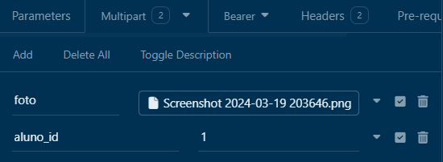

# API REST

### Descrição

- API REST simulando o cadastro de alunos de uma escola

## <a href="https://api-study.ddns.net/" target="_blank">Deploy da API</a>

## <a href="https://front-escola.ddns.net/" target="_blank">Deploy do FrontEnd</a>

# Tecnologias Ultilizadas

- Bcryptjs
- Cors
- Dotenv
- Express
- Helmet
- Jsonwebtoken
- Banco de dados - Mariadb
- Multer
- Sequelize

# EndPoints da Aplicação

### Criação de Login

## POST - /users

```bash
    {
      "nome": "Exemplo",
      "email": "exemplo@dominio.com",
      "password": "senha123"
    }
```

### Autenticação

## POST - /tokens

```bash
    {
      "email": "exemplo@dominio.com",
      "password": "senha123"
    }
```

- Resposta

```bash
    {
      "token": "eyJhbGciOiJIUzI1NiIsInR5cCI6IkpXVCJ9..."
    }
```

- Mandar na header de cada req "Bearer Token"

### Editar dados do User & DELETAR

## PUT - /users

- Mandar no corpo da req "Bearer Token"

```bash
    {
      "nome": "teste de nome",
      "email": "teste@deemail.com",
      "password": ""
    }
```

## DELETE - /users

- Mandar na header de cada req "Bearer Token"

### Alunos

- Criação de alunos

## POST - /alunos

```bash
    {
      "nome": "Aluno",
      "sobrenome": "teste",
      "email": "aluno@aluno.com",
      "idade": "14",
      "peso": "58",
      "altura": "1.70"
    }
```

### Listar todos alunos

## GET - /alunos

```bash
[
	{
		"id": 17,
		"nome": "Aluno1",
		"sobrenome": "teste1",
		"email": "aluno1@aluno.com",
		"idade": 14,
		"peso": 58,
		"altura": 1.7,
		"Fotos": []
	},
	{
		"id": 19,
		"nome": "Aluno",
		"sobrenome": "teste",
		"email": "aluno@aluno.com",
		"idade": 14,
		"peso": 58,
		"altura": 1.7,
		"Fotos": []
	}
]
```

### Listar um aluno

## GET - /alunos/:id

```bash
[
  {
    "id": 17,
    "nome": "Aluno1",
    "sobrenome": "teste1",
    "email": "aluno1@aluno.com",
    "idade": 14,
    "peso": 58,
    "altura": 1.7,
    "Fotos": []
  }
]
```

### Editar um aluno

## PUT - /alunos/:id

```bash
	{
		"nome": "aluno",
		"sobrenome": "teste"
	}
```
### Deletar um aluno

## DELETE - /alunos/:id

- Resposta

```bash
	{
    "Aluno deletado"
  }
```

### Cadastrar Foto do Aluno

## POST - /fotos

- Mandar um formulário MULTIPART




# Ultilização do projeto

### Clonar o repositório

```bash
git clone https://github.com/edsuuu/api_escola.git
```

### Acessar a pasta do repositorio

```bash
cd api_escola
```

### Instalar as Dependencias

```bash
npm install
```

### Configurar as variáveis de ambiente .env

- Se estiver usando o linux

```bash
sudo nano .env
```

- Variáveis para o banco MariaDB

```bash
DB_NAME=
DB_HOST=
DB_PORT=
DB_USERNAME=
DB_PASSWORD=

APP_PORT=

TOKEN_SECRET=1d
TOKEN_EXPIRATION=

```

### Rodar as Migrações

```bash
sequelize db:migrate
```

- Remover as Migrações

```bash
sequelize db:migrate:undo
```

# Iniciar o projeto Local

```bash
npm run dev
```
